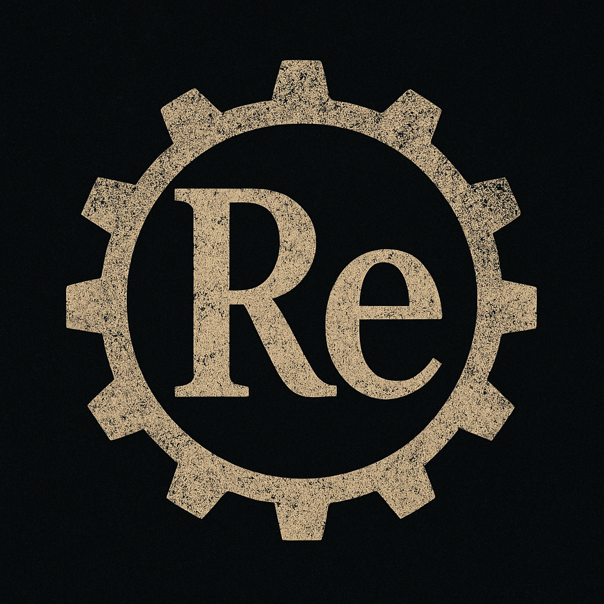

  

# Welcome to [Re:Learned]!

Explore science, math, stories, and more.  
Select a section from the sidebar to get started.

---
- [Physics](Physics/index.md): Dive into chapters like Thermodynamics and more.
- [Math](Math/index.md): Explore mathematical concepts and problem–solving.
- [Sci-Fi Short Stories](Sci-Fi/index.md): Read and submit creative science fiction.
- [Student Submissions](Student Submissions/index.md): See what your peers have created.
- [Philosophy](Philosophy/index.md): Reflect on the big questions in science.
- [Pop Science & Culture](Pop-Science/index.md): Discover science in everyday life.
- [Clarity Hub](Clarity Hub/index.md): Get clear explanations for tricky topics.
- [Beyond School](Beyond School/index.md): Learn skills and ideas for life beyond the classroom.
---

*Have feedback or ideas? Scroll down to share your thoughts!*

[def]: Physics/index.md